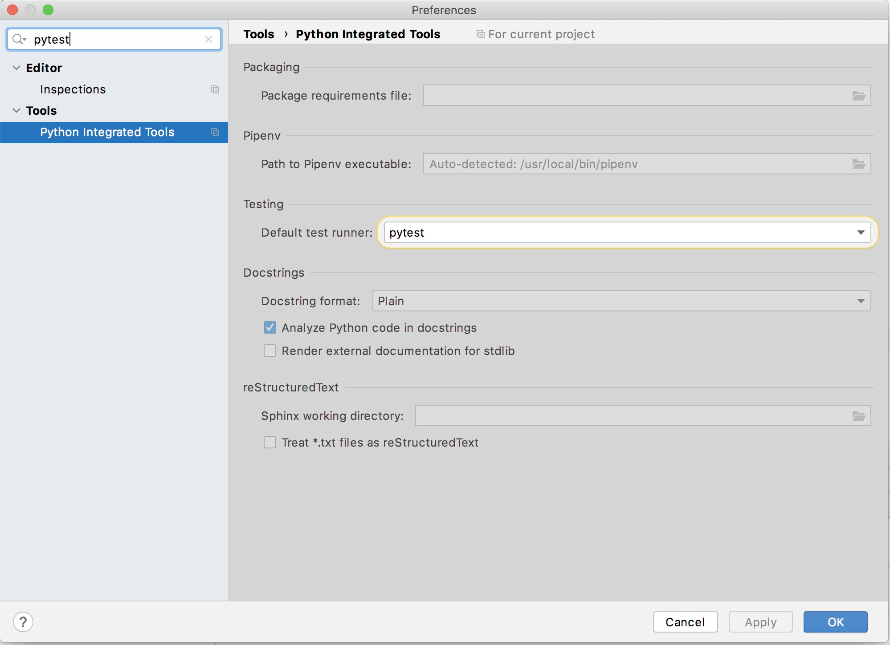

# Aiven Homework

## Abstract

This repository tries to cover the challenge as good as possible. Since this is a coding challenge, 
there are some limitations, some of them are marked as `TODO` in the code. 

## Structure

The project consists of two entry-points: 

- `producer_pansen_aiven` is responsible to gather website availability data from sites, configured in 
[`url_config.yaml`](./url_config.yaml). This data is published to the [configured](.env.example) Kafka.
- `consumer_pansen_aiven` is supposed to be the consumer of [configured](.env.example) Kafka data, which 
  then will be written to a Postgres instance (this part is still lacking). 


## Usage

This repository is intented to be used locally for execution or development. 

#### Prerequisites

- You need to have UNIX compatible OS
- You need to have `make` and *Python3.8* installed
- Probably you also need a C compiler toolchain (not sure about the dependencies)
- It is assumed you have a Python IDE installed, particulary *PyCharm*
- After checkout, run `make bootstrap dev.build` *before* opening the project in PyCharm. 
  This ensures to let PyCharm find the `venv` and its containing local Python interpreter.
- After opening the project in PyCharm, ensure the projects test-runner is configured to use 
  `pytest`
  
  

#### Execute

    Any development or usage requires to have `docker-compose` with Zookeeper and 
    Kafka up and running.

##### Execution

To simply run the services use this to prepare a local sandbox without development tools:

```bash
make build
```

.. then start a producer and a consumer in separate terminals

```bash
make producer
```

```bash
make consumer
```

##### Development

To build your development environment, use

```bash
make dev.build
```

To run all tests, use

```bash
make test
```

Once you followed the prerequisites section, you will also be able to run and debug single tests 
from PyCharm. 


## Exercise

Your task is to implement a system that monitors website availability
over the network, produces metrics about this and passes these events
through an Aiven Kafka instance into an Aiven PostgreSQL database.

For this, you need a Kafka producer which periodically checks the target
websites and sends the check results to a Kafka topic, and a Kafka
consumer storing the data to an Aiven PostgreSQL database. For practical
reasons, these components may run in the same machine (or container or
whatever system you choose), but in production use similar components
would run in different systems.

The website checker should perform the checks periodically and collect
the HTTP response time, error code returned, as well as optionally
checking the returned page contents for a regexp pattern that is
expected to be found on the page.

For the database writer we expect to see a solution that records the
check results into one or more database tables and could handle a
reasonable amount of checks performed over a longer period of time.

Even though this is a small concept program, returned homework should
include tests and proper packaging. If your tests require Kafka and
PostgreSQL services, for simplicity your tests can assume those are
already running, instead of integrating Aiven service creation and
deleting.

Aiven is a Database as a Service vendor and the homework requires using
our services. Please register to Aiven at
<https://console.aiven.io/signup.html> at which point you\'ll
automatically be given \$300 worth of credits to play around with. The
credits should be enough for a few hours of use of our services. If you
need more credits to complete your homework, please contact us.

The solution should NOT include using any of the following:

-   Database ORM libraries - use a Python DB API compliant library and
    raw SQL queries instead
-   Extensive container build recipes - rather focus your effort on the
    Python code, tests, documentation, etc.

### Criteria for evaluation

-   Code formatting and clarity. We value readable code written for
    other developers, not for a tutorial, or as one-off hack.
-   We appreciate demonstrating your experience and knowledge, but also
    utilizing existing libraries. There is no need to re-invent the
    wheel.
-   Practicality of testing. 100% test coverage may not be practical,
    and also having 100% coverage but no validation is not very useful.
-   Automation. We like having things work automatically, instead of
    multi-step instructions to run misc commands to set up things.
    Similarly, CI is a relevant thing for automation.
-   Attribution. If you take code from Google results, examples etc.,
    add attributions. We all know new things are often written based on
    search results.
-   \"Open source ready\" repository. It\'s very often a good idea to
    pretend the homework assignment in Github is used by random people
    (in practice, if you want to, you can delete/hide the repository as
    soon as we have seen it).
